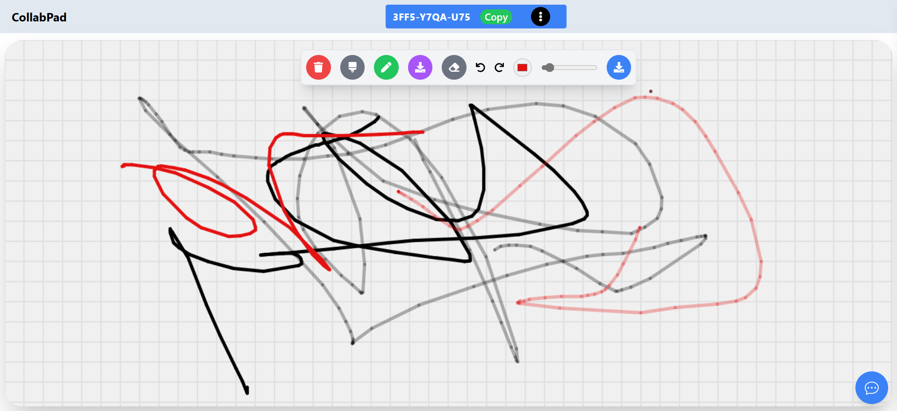

# CollabPad - Collaborative Whiteboard App

**CollabPad** is a real-time collaborative whiteboard app that allows users to draw, write, and brainstorm together seamlessly. Perfect for educational purposes, remote teamwork, or creative brainstorming, this app is designed to enhance collaboration with its simple interface and interactive tools.

## Features

- **Real-Time Collaboration**: Multiple users can join a session with a shared session code and interact with the whiteboard in real time.
- **Drawing Tools**: A set of intuitive drawing tools like pens, highlighters, erasers, and more.
- **Session Code Sharing**: Easily generate and share a unique session code for collaboration.
- **Smooth Transitions**: Animated UI transitions for a better user experience when interacting with the app.
- **Chat Integration**: In-app chat to communicate with other users in real-time.

## Screenshots




## Tech Stack

**CollabPad** is built using the following technologies:

- **Frontend:**
  - **React.js** - A JavaScript library for building user interfaces.
  - **Tailwind CSS** - A utility-first CSS framework for styling.
  - **Socket.IO** - A library for real-time web socket communication, enabling live collaboration.
  - **Canvas API** - Used for rendering drawings on the whiteboard.

- **Backend:**
  - **Node.js** - JavaScript runtime for building the server-side logic.
  - **Express.js** - A fast and minimalist web framework for Node.js.
  - **Socket.IO** (Server) - For real-time communication between the server and clients.

## Getting Started

Follow these steps to get the app up and running on your local machine:

### Prerequisites

Ensure you have the following installed:

- **Node.js** (v14+)
- **npm** or **yarn** (for package management)
- A modern web browser (e.g., Chrome, Firefox)

### Installation

1. Clone the repository to your local machine:

   ```bash
   git clone https://github.com/sarman12/WhiteBoard.git


